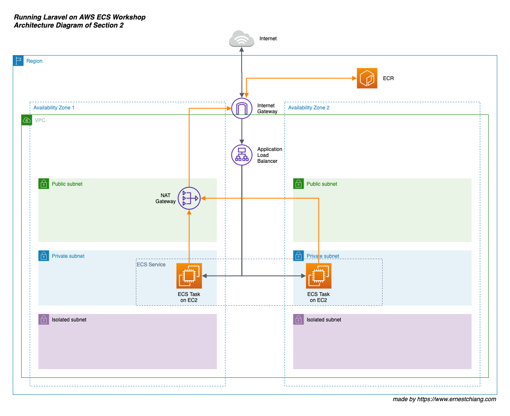

# Workshops: Running Laravel on AWS ECS

These workshops assume that we will have multiple workloads on both production and staging environments. We will achieve this goal step by step, section by section.

[Amazon Elastic Container Service](https://www.ernestchiang.com/en/notes/aws/ecs/) (Amazon ECS) allows us to easily run, scale, and secure Docker container applications on AWS, which is very suitable for a developer or a team lacking of dedicated time to take care about infrastructure.

# Highlights

- We will use as [latest Laravel LTS version](https://github.com/laravel/laravel/releases) as possible. We will use Laravel [v6.18.35](https://github.com/laravel/laravel/releases/tag/v6.18.35) at the moment.
- Using [dwchiang/nginx-php-fpm](https://hub.docker.com/r/dwchiang/nginx-php-fpm) as the docker base image to simplify the container configuration works and make us focusing on the Laravel application-first.
- Using [AWS CDK](https://www.ernestchiang.com/en/notes/aws/cdk/) to define our own cloud infrastructure as code (IaC) in a programming language.

# Outline

## Getting Started

You don't need to know or learn about AWS ECS, EC2, Fargate, or even CDK before our diving deeper, you can still enjoy the getting started sections. You only need to have an AWS account or an IAM account. We will guide you to know each parts of this architecture in the later sections.

The first two sections is getting to know there are two launch types in Amazon ECS.

- Section 1: [Getting Started on ECS Fargate Launch Type](section-01)
- Section 2: [Getting Started on ECS EC2 Launch Type](section-02)

# Architecture Overview

The workshops will go through from **running single app on Fargate** to **multiple apps on ECS Capacity Provider across Fargate and EC2 launch types** by using AWS CDK to define our own cloud infrastructure as code (IaC).

## Section 1: Getting Started on ECS Fargate Launch Type

Running single app on ECS Fargate launch type with a high availability design.


## Section 2: Getting Started on ECS EC2 Launch Type

Running single app on ECS EC2 launch type with a high availability design.



---

# Preparations

Please well prepare the preparations before attending the workshop.

- [ ] Having an IAM user with `AdministratorAccess` policy (or an AWS Root Account (not recommended))
  - [ ] Check: AWS Access Key Id
  - [ ] Check: AWS Secret Access Key
- [ ] Having [AWS CLI v2](https://docs.aws.amazon.com/cli/latest/userguide/install-cliv2.html) installed and [configured](https://docs.aws.amazon.com/cli/latest/userguide/cli-configure-quickstart.html) with at least one profile name. 
  - [ ] Please create a profile named `laravel-on-aws-ecs-workshops` for this workshop in your AWS CLI v2.
  - [ ] Check: `~/.aws/credentials`

    ```
    [laravel-on-aws-ecs-workshops]
    aws_access_key_id = AKIAxxxxxxxxxxxxxxxx
    aws_secret_access_key =
    ```

  - [ ] Check: `~/.aws/config`
    - Recommended to choose a region that supports EC2 `t4g` instance type (ARM).

    ```
    [profile laravel-on-aws-ecs-workshops]
    region = us-west-2
    output = json
    cli_pager =
    ```

- [ ] Having [Docker](https://docs.docker.com/get-docker/) on your local machine.
  - [ ] Check: `docker -v`

    ```
    ❯ docker -v
    Docker version 19.03.12, build 48a66213fe
    ```

- [ ] Having [composer](https://getcomposer.org/) on your local machine.
  - [ ] Check: `composer -V`

    ```
    ❯ composer -V
    Composer version 1.10.13 2020-09-09 11:46:34
    ```

- [ ] Having [Node.js](https://nodejs.org/en/) and [npm](https://www.npmjs.com/) on your local machine. You may use [nvm](https://github.com/nvm-sh/nvm) (Node Version Manager) to easily manage multiple versions.
  - [ ] Check: `node -v` 

    ```
    ❯ node -v
    v12.19.0
    ```

  - [ ] Check: `npm -v`

    ```
    ❯ npm -v
    6.14.8
    ```

  - [ ] (Optional) Check: `nvm ls`

---

