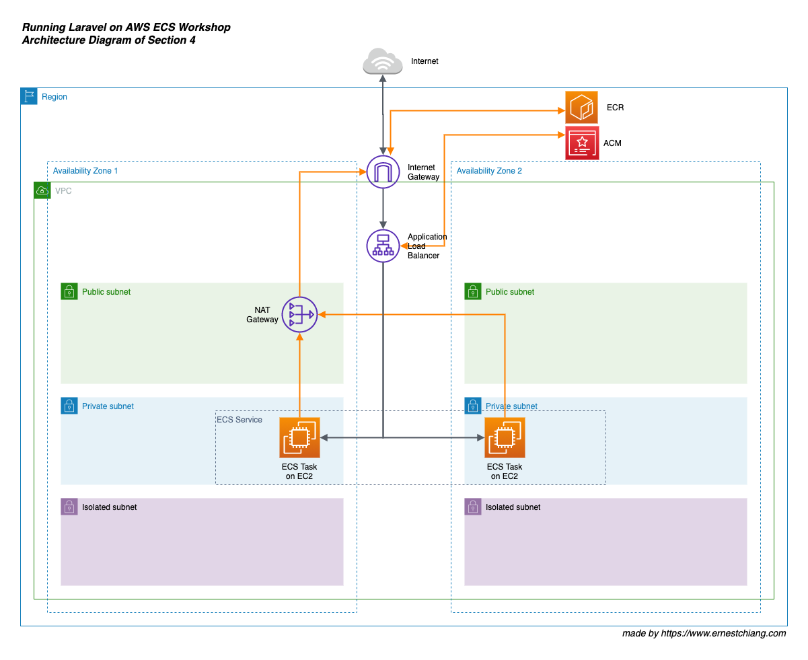
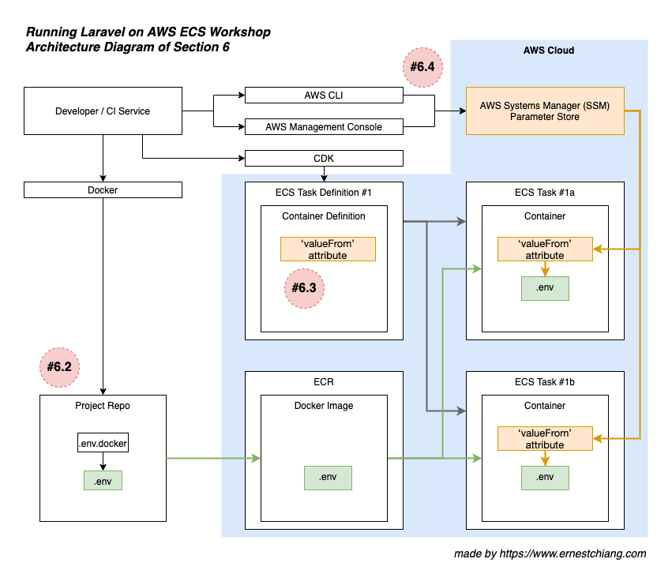

[](https://gitpod.io/#https://github.com/dwchiang/laravel-on-aws-ecs-workshops)

# Workshops: Running Laravel on AWS ECS

These workshops assume that we will have multiple workloads on both production and staging environments. We will achieve this goal step by step, section by section.

[Amazon Elastic Container Service](https://www.ernestchiang.com/en/notes/aws/ecs/) (Amazon ECS) allows us to easily run, scale, and secure Docker container applications on AWS, which is very suitable for a developer or a team lacking of dedicated time to take care about infrastructure.

# Highlights

- We will use as [latest Laravel LTS version](https://github.com/laravel/laravel/releases) as possible. We will use Laravel [v6.18.35](https://github.com/laravel/laravel/releases/tag/v6.18.35) at the moment.
- Using [dwchiang/nginx-php-fpm](https://hub.docker.com/r/dwchiang/nginx-php-fpm) as the docker base image to simplify the container configuration works and make us focusing on the Laravel application-first.
- Using [AWS CDK](https://www.ernestchiang.com/en/notes/aws/cdk/) to define our own cloud infrastructure as code (IaC) in a programming language.

---

# Preparations

Please well prepare the preparations before attending the workshop.

- [ ] Having an IAM user with `AdministratorAccess` policy (or an AWS Root Account (not recommended))
  - [ ] Check: **AWS Access Key Id**
  - [ ] Check: **AWS Secret Access Key**
  - Please DO NOT commit your **AWS Access Key Id** and/or **AWS Secret Access Key** into version control repository.

- [ ] Having [git](https://git-scm.com/).
  - [ ] Check: `git --version`

    ```
    ❯ git --version
    git version 2.29.1
    ```

- [ ] git clone this repository to your local machine: `git clone git@github.com:dwchiang/laravel-on-aws-ecs-workshops.git`

- [ ] Having [GNU Make](https://www.gnu.org/software/make/).
  - [ ] Check: `make -v`

    ```
    ❯ make -v
    GNU Make 3.81
    ```

- [ ] Having [tree](http://mama.indstate.edu/users/ice/tree/) command.
  - [ ] Check: `tree --version`

    ```
    ❯ tree --version
    tree v1.8.0 (c) 1996 - 2018 by Steve Baker, Thomas Moore, Francesc Rocher, Florian Sesser, Kyosuke Tokoro
    ```

- [ ] Having [AWS CLI v2](https://docs.aws.amazon.com/cli/latest/userguide/install-cliv2.html) installed and [configured](https://docs.aws.amazon.com/cli/latest/userguide/cli-configure-quickstart.html) with at least one profile name. 
  - [ ] Check: `aws --version`

    ```
    ❯ aws --version
    aws-cli/2.0.59 Python/3.9.0 Darwin/19.6.0 source/x86_64
    ```
  - Tranditional Way
    - [ ] Please create a profile named `laravel-on-aws-ecs-workshops` for this workshop in your AWS CLI v2. (If you are not using the same profile name, please update the profile name in the `export-variables` file of each section folder or your project repo folder.)
    - [ ] Check: `~/.aws/credentials`

        ```
        [laravel-on-aws-ecs-workshops]
        aws_access_key_id = AKIAxxxxxxxxxxxxxxxx
        aws_secret_access_key =
        ```

    - [ ] Check: `~/.aws/config`
        - Recommended to choose a region that supports EC2 `t4g` instance type (ARM).

        ```
        [profile laravel-on-aws-ecs-workshops]
        region = us-west-2
        output = json
        cli_pager =
        ```

  - AWS SSO Way
    - [ ] Enable AWS SSO in AWS Organizations and AWS SSO in AWS Management Console. Create an SSO user and grant admin permissions on the user. Then you can login with this SSO account in AWS CLI.

        ```
        # configure AWS SSO in your AWS CLI
        ❯ aws configure sso --profile laravel-on-aws-ecs-workshops

        # get credentials
        ❯ ./utils/refresh_aws_credentials.sh
        ```

- [ ] Having [jq](https://stedolan.github.io/jq/download/) to parse json outputs from AWS CLI.
  - [ ] Check: `jq --version`

    ```
    ❯ jq --version
    jq-1.6
    ```

- [ ] Having [Docker](https://docs.docker.com/get-docker/) on your local machine.
  - [ ] Check: `docker -v`

    ```
    ❯ docker -v
    Docker version 19.03.12, build 48a66213fe
    ```

- [ ] Having [composer](https://getcomposer.org/) on your local machine to install Laravel.
  - [ ] Check: `composer -V`

    ```
    ❯ composer -V
    Composer version 1.10.13 2020-09-09 11:46:34
    ```

- [ ] Having [Node.js](https://nodejs.org/en/) and [npm](https://www.npmjs.com/) on your local machine. You may use [nvm](https://github.com/nvm-sh/nvm) (Node Version Manager) to easily manage multiple versions.
  - [ ] Check: `node -v` 

    ```
    ❯ node -v
    v12.19.0
    ```

  - [ ] Check: `npm -v`

    ```
    ❯ npm -v
    6.14.8
    ```

  - [ ] (Optional) Check: `nvm ls`

- [ ] Having [AWS CDK](https://www.ernestchiang.com/en/notes/aws/cdk/)
  - [ ] Check : `cdk --version`

- [ ] Having a domain name you can manage. (e.g adding a new CNAME record for it.)
  - [ ] Required since section 4.

---

# Getting Started

You don't need to know or learn about AWS ECS, EC2, Fargate, or even CDK before our diving deeper, you can still enjoy the getting started sections. You only need to have an AWS account or an IAM account. We will guide you to know each parts of this architecture in the later sections.

The first two sections is getting to know there are two launch types in Amazon ECS:

- Section 1: [Getting Started on ECS Fargate Launch Type](section-01)
- Section 2: [Getting Started on ECS EC2 Launch Type](section-02)

Then we move on to introduce fundamental requirements for running a Laravel service on Amazon ECS:

- Section 3: [Prepare a project repository](section-03)
- Section 4: [Using AWS Certificate Manager (ACM) to deploy SSL/TLS certificates](section-04)
- Section 5: [Enable Laravel Logging](section-05)
- Section 6: [Handling Environment Variables](section-06)

---

# Architecture Overview

The workshops will go through from **running single app on Fargate** to **multiple apps on ECS Capacity Provider across Fargate and EC2 launch types** by using AWS CDK to define our own cloud infrastructure as code (IaC).

## Section 1: Getting Started on ECS Fargate Launch Type

Running single app on ECS Fargate launch type with a high availability design.


## Section 2: Getting Started on ECS EC2 Launch Type

Running single app on ECS EC2 launch type with a high availability design.


## Section 4: Using AWS Certificate Manager (ACM) to deploy SSL/TLS certificates

Have SSL/TLS connection is the basic implementation nowadays.



## Section 5: Enable Laravel Logging

Direct Laravel logs in the container to Amazon CloudWatch Logs.


## Section 6: Handling Environment Variables

Bridging Laravel `.env` file, ECS Container Definition `valueFrom` and AWS SSM Parameter Store to load environment variables.




