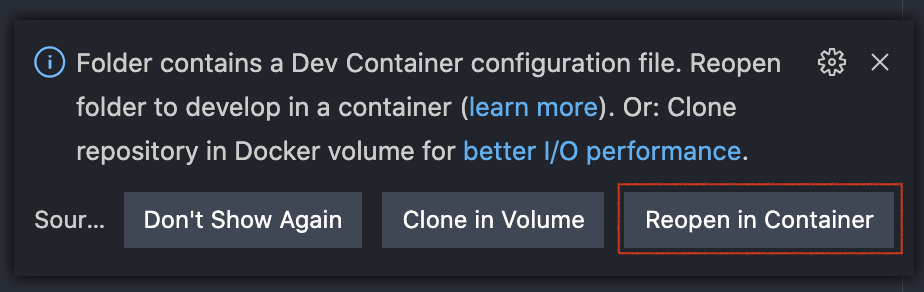

# Preparations

The workshop includes multiple elements across local development environment, cloud environment, Laravel configurations and more. To make sure we enjoy all the core knowledge content of the workshop, please finish the `Preparations` section before attending the workshop.

I also design a container as the development environment for the workshop, so that you can save lots of time to check all the preparation items before attending the workshop. However, after the workshop, you may still need to setup your own development evnironment on your laptop or any local computers. This `Preparations` document will have all the elements that we used in the workshop. You can follow this document to check if you have all the elements in your development environment and ready to build your cool projects. Enjoy :)

## Checklist

- [ ] Having an IAM user with `AdministratorAccess` policy (or an AWS Root Account (not recommended))
  - [ ] Check: **AWS Access Key Id**
  - [ ] Check: **AWS Secret Access Key**
  - Please DO NOT commit your **AWS Access Key Id** and/or **AWS Secret Access Key** into version control repository.

- [ ] Choose one from [Method A (Workshop inside a Container)](method-a-workshop-inside-a-container) or [Method B (Setup on My Local)](method-b-setup-on-my-local).
  - [ ] Method A is the best option to attend the workshop. Simple and aligned. (Est. 5 minutes.)
  - [ ] Method B covers all the elements you need for you to setup your **Laravel+AWS** development environment on your local computer. Maybe a little complex for the beginners, but no worries, it is step-by-step just like the workshop, so relax and take all the steps, you will be all set :) (Est. 15-60 minutes. It depends.)

## Method A: Workshop inside a Container

This is the best option to attend the workshop. Simple and aligned development environment. All you need to do is follow the Visual Studio Code (vscode) 3-step instruction about <[Developing inside a Container](https://code.visualstudio.com/docs/remote/containers)>.

1. Install and configure [Docker](https://www.docker.com/get-started) for your operating system.
2. Install [Visual Studio Code](https://code.visualstudio.com/).
3. Install the [Remote Development extension pack](https://aka.ms/vscode-remote/download/extension).

Once you are all set, git clone the workshop, and ready to go:

```
❯ git clone https://github.com/dwchiang/laravel-on-aws-ecs-workshops.git

❯ cd laravel-on-aws-ecs-workshops

❯ code .
```

You will see a message box on the right-bottom corner, click the `Reopen in Container` button.



That's all. Enjoy the workshop. Let's start the [Section 1](../section-01)!

## Method B: Setup on My Local

- [ ] Having [git](https://git-scm.com/).
  - [ ] Check: `git --version`

    ```
    ❯ git --version
    git version 2.29.1
    ```

- [ ] git clone this repository to your local machine: `git clone git@github.com:dwchiang/laravel-on-aws-ecs-workshops.git`

- [ ] Having [GNU Make](https://www.gnu.org/software/make/).
  - [ ] Check: `make -v`

    ```
    ❯ make -v
    GNU Make 3.81
    ```

- [ ] Having [tree](http://mama.indstate.edu/users/ice/tree/) command.
  - [ ] Check: `tree --version`

    ```
    ❯ tree --version
    tree v1.8.0 (c) 1996 - 2018 by Steve Baker, Thomas Moore, Francesc Rocher, Florian Sesser, Kyosuke Tokoro
    ```

- [ ] Having [AWS CLI v2](https://docs.aws.amazon.com/cli/latest/userguide/install-cliv2.html) installed and [configured](https://docs.aws.amazon.com/cli/latest/userguide/cli-configure-quickstart.html) with at least one profile name. 
  - [ ] Check: `aws --version`

    ```
    ❯ aws --version
    aws-cli/2.0.59 Python/3.9.0 Darwin/19.6.0 source/x86_64
    ```
  - Tranditional Way
    - [ ] Please create a profile named `laravel-on-aws-ecs-workshops` for this workshop in your AWS CLI v2. (If you are not using the same profile name, please update the profile name in the `export-variables` file of each section folder or your project repo folder.)
    - [ ] Check: `~/.aws/credentials`

        ```
        [laravel-on-aws-ecs-workshops]
        aws_access_key_id = AKIAxxxxxxxxxxxxxxxx
        aws_secret_access_key =
        ```

    - [ ] Check: `~/.aws/config`
        - Recommended to choose a region that supports EC2 `t4g` instance type (ARM).

        ```
        [profile laravel-on-aws-ecs-workshops]
        region = us-west-2
        output = json
        cli_pager =
        ```

  - AWS SSO Way
    - [ ] Enable AWS SSO in AWS Organizations and AWS SSO in AWS Management Console. Create an SSO user and grant admin permissions on the user. 
    - [ ] Then you can login with this SSO account in AWS CLI:
    

        ```
        # configure AWS SSO in your AWS CLI
        ❯ aws configure sso --profile laravel-on-aws-ecs-workshops
        SSO start URL [None]: https://your-sso-portal-short-name.awsapps.com/start                                                             
        SSO Region [None]: us-west-2 #please change to use the corresponding region of your AWS SSO                                                                                         
        Attempting to automatically open the SSO authorization page in your default browser.
        If the browser does not open or you wish to use a different device to authorize this request, open the following URL:

        https://device.sso.us-west-2.amazonaws.com/

        Then enter the code:

        HRCB-WSLR
        There are 6 AWS accounts available to you.
        Using the account ID 123456789012
        The only role available to you is: AdministratorAccess
        Using the role name "AdministratorAccess"
        CLI default client Region [None]: us-west-2                                                                          
        CLI default output format [None]: json                                                                               

        To use this profile, specify the profile name using --profile, as shown:

        aws s3 ls --profile laravel-on-aws-ecs-workshops
        ```

        ```
        # refrech credentials into your ~/.aws/credentials
        ❯ ./utils/refresh_aws_credentials.sh laravel-on-aws-ecs-workshops
        => requesting temporary credentials
        => updating ~/.aws/credentials as profile laravel-on-aws-ecs-workshops
        [OK] done
        ```

- [ ] Having [jq](https://stedolan.github.io/jq/download/) to parse json outputs from AWS CLI.
  - [ ] Check: `jq --version`

    ```
    ❯ jq --version
    jq-1.6
    ```

- [ ] Having [Docker](https://docs.docker.com/get-docker/) on your local machine.
  - [ ] Check: `docker -v`

    ```
    ❯ docker -v
    Docker version 19.03.12, build 48a66213fe
    ```

- [ ] Having [composer](https://getcomposer.org/) on your local machine to install Laravel.
  - [ ] Check: `composer -V`

    ```
    ❯ composer -V
    Composer version 1.10.13 2020-09-09 11:46:34
    ```

- [ ] Having [Node.js](https://nodejs.org/en/) and [npm](https://www.npmjs.com/) on your local machine. You may use [nvm](https://github.com/nvm-sh/nvm) (Node Version Manager) to easily manage multiple versions.
  - [ ] Check: `node -v` 

    ```
    ❯ node -v
    v12.19.0
    ```

  - [ ] Check: `npm -v`

    ```
    ❯ npm -v
    6.14.8
    ```

  - [ ] (Optional) Check: `nvm ls`

- [ ] Having [AWS CDK](https://www.ernestchiang.com/en/notes/aws/cdk/)
  - [ ] Check : `cdk --version`

- [ ] Having a domain name you can manage. (e.g adding a new CNAME record for it.)
  - [ ] Required since section 4.

That's all. Enjoy the workshop. Let's start the [Section 1](../section-01)!
