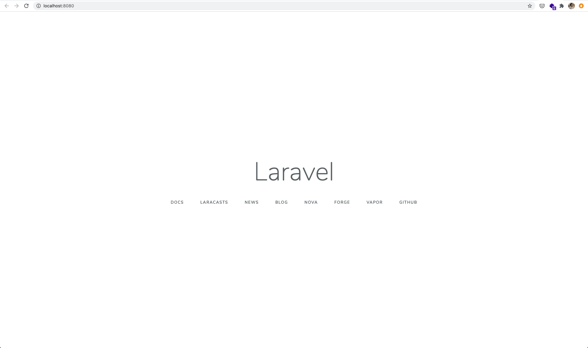

# Section 1: Getting Started on Fargate

# Objective

We are going to run a single Laravel app on ECS **Fargate launch type** with a high availability architecture design. 

# Highlights

- **Application-first design.**
- To manage the cost of this workshop, we reduce the number of NAT Gateway to only one.

# Architecture Overview


# Workshop

- Step 1.1: Build & Running Laravel on local machine
- Step 1.2: Publish image into Amazon ECR
- Step 1.3: Deployment & Running on Amazon Fargate (ECS)
- Step 1.4: Next section or Destroy the deployment

We will do all the **Section 1** works in the folder `./section-01/`:

```
❯ pwd
/xxx/xxx/xxx/laravel-on-aws-ecs-workshops

❯ cd section-01
```

## Step 1.1: Build & Running Laravel on local machine

Let's create a new Laravel project in the folder `./secion-01/src/`:

- You can use any version of Laravel you preferred. In this workshop, we will use the latest TLS version.

```
❯ pwd
/xxx/xxx/xxx/laravel-on-aws-ecs-workshops/section-01

❯ composer create-project --prefer-dist laravel/laravel:6.18.35 src
```

Here is the current project folder structure in `./section-01`:

```
❯ pwd
/xxx/xxx/xxx/laravel-on-aws-ecs-workshops/section-01

❯ tree --dirsfirst -L 1
.
├── cdk
├── images
├── src
├── Dockerfile
├── Makefile
├── README.md
└── export-variables.example
```

Before our building the docker image, let's **configure** environment variables that will be used in the build. 

- Please duplicate the example file of variables from `export-variables.example` to `export-variables`, then load it by `source` command. 
- You may need to edit the file `export-variables` to fit your situation. Especially the `AWS_DEFAULT_PROFILE` value. 

```
# duplicate the example file of variables
❯ cp export-variables.example export-variables

# edit
❯ vim export-variables

# load
❯ source export-variables
```

Now it's time to **build** the docker image:

```
❯ make version

❯ make build

...
...

Successfully built 3bc757f1xxxx
Successfully tagged my-laravel-on-aws-ecs-workshop:latest

REPOSITORY                       TAG                                  IMAGE ID            CREATED             SIZE
my-laravel-on-aws-ecs-workshop   7.4.10-fpm-1.18.0-nginx-buster       3bc757f1xxxx        1 second ago        604MB
my-laravel-on-aws-ecs-workshop   latest                               3bc757f1xxxx        1 second ago        604MB
```

If you get successfully built, then we can make it run:

```
❯ make run

# or

❯ docker run --cpus=1 --memory=512m -p 8080:80 my-laravel-on-aws-ecs-workshop:latest

# or change to use another port other than 8080, for example 8082

❯ docker run --cpus=1 --memory=512m -p 8082:80 my-laravel-on-aws-ecs-workshop:latest
```

Now, you are running Laravel on a container on your local machine. Please visit this URL `http://localhost:8080/` (or `http://127.0.0.1:8080/`) in your browser.



- In this step, we has verified that we are able to build the laravel docker image and make it run on our local machine.
- You can stop the running container by using `docker ps` and `docker stop {CONTAINER_ID}`.

Next step, we are going to publish the image you just built into Amazon ECR (Elastic Container Registry) and deploy it to run on AWS Fargate.

## Step 1.2: Publish image into Amazon ECR

Once you can build and run the laravel container successfully on your local machine, we can publish the image into Amazon ECR (Elastic Container Registry) under your AWS Account. We will pull the image later on and deploy it on AWS Fargate to run.

- If you want to know the details of the commands, feel free to take a look at `publish` section in `Makefile` file.

```
❯ source export-variables

❯ aws configure get ${AWS_DEFAULT_PROFILE}.region

❯ make version

❯ make publish
```

You can check at Amazon ECR service in AWS Management Console.


## Step 1.3: Deployment & Running on AWS Fargate (ECS)

In this step, we will plan, define and deploy our very first version of AWS infrastructure that we are going to deploy our laravel container to run on it.

The deployment tool we are going to use is [AWS CDK](https://aws.amazon.com/cdk/) (AWS Cloud Development Kit). We can define cloud infrastructure using familiar programming languages. Ernest (AWS Community Hero) wrote a [study notes about AWS CDK](https://www.ernestchiang.com/en/notes/aws/cdk/), have a quick read if you are interested in knowing more details.

There are couple AWS services we will include in our v1 infra:

- [Region](https://aws.amazon.com/about-aws/global-infrastructure/)
- [AZ](https://aws.amazon.com/about-aws/global-infrastructure/) (Availability Zone)
- [VPC](https://aws.amazon.com/vpc/) (Virtual Private Cloud)
- [Subnet](https://docs.aws.amazon.com/vpc/latest/userguide/VPC_Subnets.html)
- [ALB](https://aws.amazon.com/elasticloadbalancing/) (Application Load Balancer)

To make this workshop as simple as possible, we will go with all the services with a minimum count:

- Region x1
- AZ x2
- VPC x1
- Subnets: public x2, private x2, isolated x2
- NAT Gateways x1
- ALB x1 (requires 2 subnets in 2 different AZ)

So that we can focus on our application first, and extend each services from one to multiple in the later sections to have high availability and so on.


Let's get into the `./section-01/cdk` folder:

```
❯ cd cdk

❯ pwd
/xxx/xxx/xxx/laravel-on-aws-ecs-workshops/section-01/cdk

❯ npm install
```

Now, it's time to bootstrap the cdk:

```
❯ cdk bootstrap
 ⏳  Bootstrapping environment aws://111111111111/us-west-2...
CDKToolkit: creating CloudFormation changeset...
[██████████████████████████████████████████████████████████] (3/3)

 ✅  Environment aws://111111111111/us-west-2 bootstrapped.
```

Synth:

```
❯ cdk synth
```

Now, it's time to deploy :)

```
❯ cdk deploy

# follow the instruction on the CLI, usually need to press `y`.

...
...

Outputs:
DevSection1LaravelOnAwsWorkshopStack.DevSection1AlbDnsName = DevSe-DevSe-11AOKXxxxxxxx-1234567890.us-west-2.elb.amazonaws.com
```

Now you can test in your browser by visiting `http://DevSe-DevSe-11AOKXxxxxxxx-1234567890.us-west-2.elb.amazonaws.com/`. You will see the same Laravel page with your running on local machine. (Note: please make sure you are using `http://` insteads of `https://` for now.)

### Learning Station

You can look around in AWS Management Console to see what resources are created by CDK:

- CloudFormation: Stacks, Events, Resources, Outputs
- ECS: Clusters, Services, Task Definitions
- VPC: Subnets, Route Tables, Internet Gateways, Elastic IPs, NAT Gateways, Network ACL, Security Groups
- EC2: Load Balancers, Listeners, Target Groups

## Step 1.4: Next section or Destroy the deployment

You did a great job! Let's heading to [Section 2](../section-02/)!

If you want to take a rest for now, please remember to destory the deployment of this section by using:

```
❯ cdk destroy
```

- [ ] Check: You can double check if all the resources are cleaned up by visiting CloudFormation service in your AWS Management Console with the same AWS Region you assigned in AWS CLI.

- [ ] Check: If you are not going to continue the following sections of this workshop, please remember to remove the docker images in your ECR by logging into your AWS Management Console > ECR.

# Reference

- Study Notes: [Amazon Elastic Container Service (Amazon ECS)](https://www.ernestchiang.com/en/notes/aws/ecs/) 
- Study Notes: [AWS Cloud Development Kit (AWS CDK)](https://www.ernestchiang.com/en/notes/aws/cdk/)
- If you don't know your AWS Account ID, use this AWS CLI command: `aws sts get-caller-identity`.