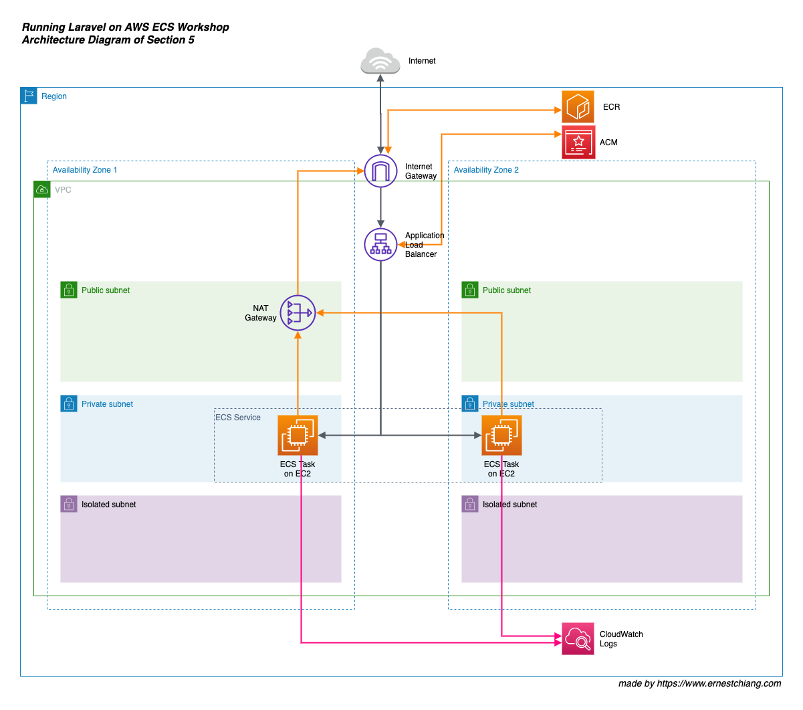
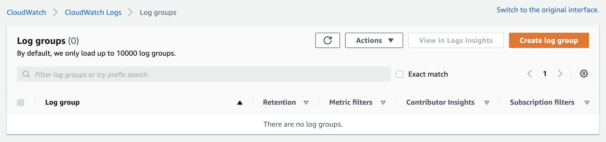
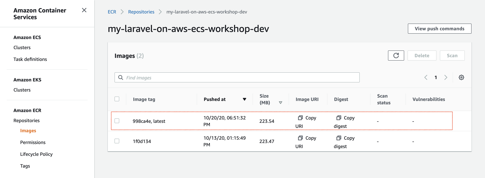
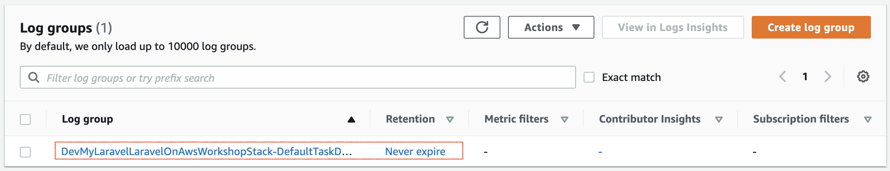
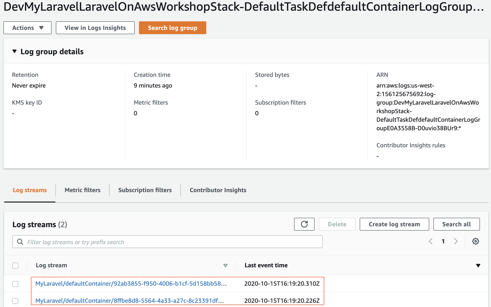
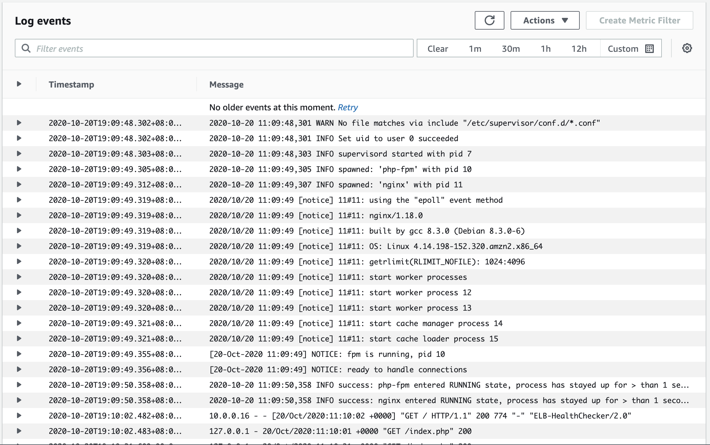

# Section 5: Enable Laravel Logging

# Objective

Let's enable Laravel logging and make our Laravel application logs direct into [Amazon CloudWatch Logs](https://docs.aws.amazon.com/AmazonCloudWatch/latest/logs/WhatIsCloudWatchLogs.html).

# Highlights

- Know how to check Laravel logs with [Amazon CloudWatch Logs](https://docs.aws.amazon.com/AmazonCloudWatch/latest/logs/WhatIsCloudWatchLogs.html).
- Briefly learn how to modify Laravel `.env` environment variable file. (We will find out more about setting environment variable file at [next section](../section-06/))

# Architecture Overview



# Workshop

- Step 5.1: Duplicate files from workshop into your project repo
- Step 5.2: Direct your application stdout into CloudWatch Logs
- Step 5.3: Configure Laravel Logging to stdout
- Step 5.4: Build & Publish Docker Image
- Step 5.5: Deployment

## Prerequisite

- Section 1 or 2: make sure you have published docker image into your ECR.
- Section 3: have a project repo.
- Login your AWS Management Console > CloudWatch Logs.

## Step 5.1: Duplicate files from workshop into your project repo

First of all, please clean up the folders and files except your `src` folder in your project repo. Please refer to [Step 3.4](../section-03/).

Duplicate files from workshop section 5 folder:

```
# Make sure you are at workshop base folder
❯ pwd
/xxx/xxx/xxx/laravel-on-aws-ecs-workshops

❯ cd section-05

# If your project repo path is different than the folder design in Section 3, 
# please modify the path below.
❯ rsync -av --progress ./ ../../my-laravel-on-ecs --exclude images

# Switch to your project repo
❯ cd ../../my-laravel-on-ecs
```

## Step 5.2: Direct your application stdout into CloudWatch Logs

At current phase, if you check out the CloudWatch Logs in your AWS Management Console at the region you deployed across section 1~4, you will find no log group was created. Therefore we can not see any outputs or logs inside your application container.



Our plan is making Laravel outouts logs into stdout stream in the container, and direct the stdout stream into Amazon CloudWatch Logs. 

In this step 5.2, we will direct the [standard output stream](https://en.wikipedia.org/wiki/Standard_streams) **stdout** in your **my-laravel-on-ecs** Laravel application container into Amazon CloudWatch Logs, so that we can check logs easily via AWS Management Console or AWS CLI.

We can assign a `logging` properity in our ECS Task Definition in the CDK script:

(You don't need to edit your code right now, we will proceed all of them toegther later soon.)

```javascript
    const container = ec2TaskDefinition.addContainer('defaultContainer', {
      image: ecs.ContainerImage.fromEcrRepository(ecrRepo), 
      memoryLimitMiB: 512,
      cpu: 256,
      logging: new ecs.AwsLogDriver({
        streamPrefix: 'MyLaravel',
        logRetention: logs.RetentionDays.SIX_MONTHS,
      }),
    });
```

In the next step 5.3, we will configure Laravel logging system from its default log file `logs/laravel.log` to **stdout** stream.

## Step 5.3: Configure Laravel Logging to stdout

Laravel utilizes the [Monolog](https://github.com/Seldaek/monolog) library, which provides support for a variety of powerful log handlers. Please refer to [Laravel Logging](https://laravel.com/docs/master/logging) docs (switch to the Laravel version you are using) to find out more details about logging.

Let's update `config/logging.php` configuration file for our application's logging system. We will add a log channel named `stdout`.

```php
  'stdout' => [
      'driver' => 'monolog',
      'handler' => StreamHandler::class,
      'formatter' => env('LOG_STDERR_FORMATTER'),
      'with' => [
          'stream' => 'php://stdout',
      ],
      'level' => 'debug',
  ],
```

We also need to modify **LOG_CHANNEL** variable from `stack` to `stdout` in `.env` file:

```
LOG_CHANNEL=stdout
```

Now you get the ideas of step 5.2 and step 5.3, let's implement them all together in your **my-laravel-on-ecs** project repo folder.

If you have done the step 5.1, you will find a folder named `src-patch` inside of your project repo right now (along with `src` folder).

```
# Make sure you are at project repo base folder
❯ pwd
/xxx/xxx/xxx/my-laravel-on-ecs

❯ tree --dirsfirst -L 1
.
├── cdk
├── src
├── src-patch
├── Dockerfile
├── Makefile
├── README.md
├── export-variables
├── export-variables.example

3 directories, 5 files

❯ cd src-patch

❯ tree --dirsfirst -a     
.
├── config
│   └── logging.php
└── .env

1 directory, 2 files
```

There are two patch files in this section:

- config/logging.php
- .env

We are going to place them into your src folder, and build a new Docker image, and publish it into AWS ECR. Then we can deploy it in the next step.

```
❯ pwd
/xxx/xxx/xxx/my-laravel-on-ecs/src-patch

❯ rsync -av --progress ./ ../src

# double check
❯ cd ..
❯ pwd
/xxx/xxx/xxx/my-laravel-on-ecs

❯ cat ./src/.env | grep LOG_CHANNEL
LOG_CHANNEL=stdout

❯ cat ./src/config/logging.php | grep stdout
        'stdout' => [
                'stream' => 'php://stdout',
```

## Step 5.4: Build & Publish Docker Image

We have updated with the source patch so we should have a git commit to have a record.

```
❯ pwd
/xxx/xxx/xxx/my-laravel-on-ecs

❯ git add .

❯ git commit -m 'section 5'

```

and it's time to re-build the Docker image and publish it onto AWS ECR again.

```
❯ pwd
/xxx/xxx/xxx/my-laravel-on-ecs

❯ source export-variables
❯ aws configure get ${AWS_DEFAULT_PROFILE}.region
us-west-2

# Double check all the variables before starting the build
# You should see all the variables have a value.
❯ make version
{
  "GIT_COMMIT_HASH":       "998ca4e",
  "VERSION_PHP_FPM":       "7.4.10"
  "VERSION_PHP_FPM_MINOR": "7.4"
  "VERSION_NGINX":         "1.18.0"
  "VERSION_OS":            "buster"
  "VERSION":               "7.4.10-fpm-1.18.0-nginx-buster"
  "BASE_VENDOR_PROJECT":   "dwchiang/nginx-php-fpm"
  "APP_IMAGE_NAME":        "my-laravel-on-aws-ecs-workshop"
  "APP_REPO_NAME":         "my-laravel-on-aws-ecs-workshop-dev"
  "ECR_REPO_IMAGE_LATEST": "123456789012.dkr.ecr.us-west-2.amazonaws.com/my-laravel-on-aws-ecs-workshop-dev:latest"
  "ECR_REPO_IMAGE_HASH":   "123456789012.dkr.ecr.us-west-2.amazonaws.com/my-laravel-on-aws-ecs-workshop-dev:998ca4e"
}

❯ make build

❯ make publish
```

You can check at Amazon ECR service in AWS Management Console.



## Step 5.5: Deployment

Now, Let's deploy our modified source code on Amazon ECS. 

```
❯ cd cdk

❯ npm install

❯ cdk bootstrap
 ⏳  Bootstrapping environment aws://111111111111/us-west-2...
CDKToolkit: creating CloudFormation changeset...
[██████████████████████████████████████████████████████████] (3/3)

 ✅  Environment aws://111111111111/us-west-2 bootstrapped.
```

Synth:

```
❯ cdk synth
```

Now, it's time to deploy :)

```
❯ cdk deploy

# follow the instruction on the CLI, usually need to press `y`.

...
...

```

When you see something like this and seem pending there, please check with [section 4.3](../section-04/).

```
...
...


Outputs:
DevMyLaravelLaravelOnAwsWorkshopStack.DevMyLaravelActionCname = Please setup a CNAME record mylaravel.your_domain_name_here.com to DevMy-DevMy-11AOKXxxxxxxx-1234567890.us-west-2.elb.amazonaws.com
DevMyLaravelLaravelOnAwsWorkshopStack.DevMyLaravelActionVisit = Visit https://mylaravel.your_domain_name_here.com
DevMyLaravelLaravelOnAwsWorkshopStack.DevMyLaravelAlbDnsName = DevMy-DevMy-11AOKXxxxxxxx-1234567890.us-west-2.elb.amazonaws.com
```

Once CDK finishs the deployment, we can visit the Laravel application at https://mylaravel.your_domain_name_here.com (You may need to review [section 4.3](../section-04/) to setup the CNAME if you did `cdk destroy` in the previous section.)

Now the Amazon CloudWatch Logs should start to receive stdout stream from the Laravel application containers (the ECS Tasks).





Please check with your AWS Management Console > Service: CloudWatch > CloudWatch Logs > Log Group > Log Streams.

You should see two log streams because we set the ECS task definition with desired count to 2. Each ECS task will have it own log stream in our design. Click on any log stream to checkout what kind of logs you will receive.



Great job! Now you can check the Laravel logs in Amazon CloudWatch which should be very helpful on debug works. We are ready to continue the [Section 6](../section-06/) :)

If you are not going to the next section right now, please do remember to run `cdk destroy`. Also, the CloudWatch logs will not be cleaned up by cdk destroy. You can keep or remove them but do remember to double check the latest [pricing of CloudWatch](https://aws.amazon.com/cloudwatch/pricing/). As of the time writing this workshop, free tier covers 5GB Logs data.

# Reference

- Official docs: [Laravel Logging](https://laravel.com/docs/master/logging)