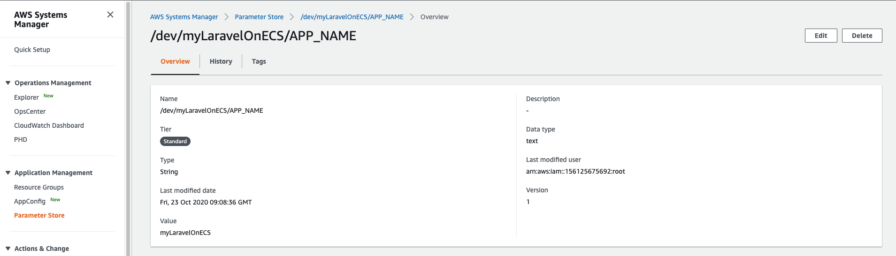
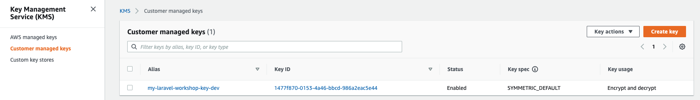
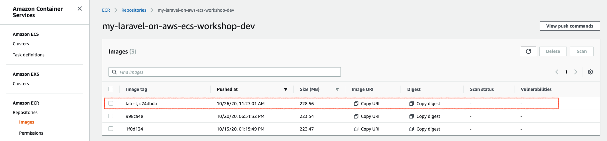
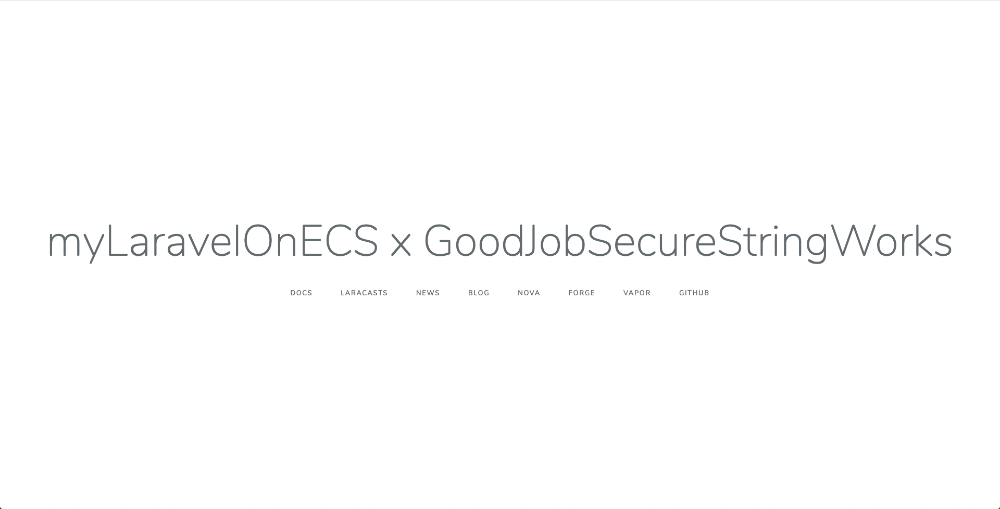

# Section 6: Handling Environment Variables

# Objective

Learn how to handling [Laravel environment variables](https://laravel.com/docs/master/configuration) (the `.env` file) in between project repository, docker image, running container, and [AWS Systems Manager (SSM) Parameter Store](https://docs.aws.amazon.com/systems-manager/latest/userguide/systems-manager-parameter-store.html).

# Highlights

- Understand [Laravel Environment Configuration](https://laravel.com/docs/master/configuration).
- Modifing Laravel `.env` file to load environment variables from container (system).
- Specifying environment variables using ‘valueFrom’ attribute in ECS Container Definition.
- Put environment variables into AWS SSM Parameter Store in either **String** or **SecureString** types.
- Using AWS KMS (Key Management Service) to secure the **SecureString** type in SSM Parameter Store.

# Architecture Overview


# Workshop

- Step 6.1: Duplicate files from workshop into your project repo
- Step 6.2: Modify Laravel `.env` file to `.env.docker` file
- Step 6.3: Implement `valueFrom` attribute in ECS Container Definition in CDK
- Step 6.4: Put variables into SSM Parameter Store
- Step 6.5: Edit variable file & source patch
- Step 6.6: Build & Publish Docker Image
- Step 6.7: Deployment

## Prerequisite

- Section 1 or 2: make sure you have published docker image into your ECR.
- Section 3: have a project repo.
- Login your AWS Management Console > AWS Systems Manager Parameter Store.

## Step 6.1: Duplicate files from workshop into your project repo

First of all, please clean up the folders and files except your `src` folder in your project repo. Please refer to [Step 3.4](../section-03/).

Duplicate files from workshop section 6 folder:

```
# Make sure you are at workshop base folder
❯ pwd
/xxx/xxx/xxx/laravel-on-aws-ecs-workshops

❯ cd section-06

# If your project repo path is different than the folder design in Section 3, 
# please modify the path below.
❯ rsync -av --progress ./ ../../my-laravel-on-ecs --exclude images

# Switch to your project repo
❯ cd ../../my-laravel-on-ecs
```

## Step 6.2: Modify Laravel `.env` file to `.env.docker` file

(You don't need to do anything in this step. The implementation is included in Step 6.1.)

We need to modify the `.env` file to be able to receive environment variables from the container. The original `.env` file looks like this:

```
APP_NAME=Laravel
APP_ENV=local
APP_KEY=base64:y+1n0yg1jk1U9JDhJu/jmOcOnkag9WITIi6Lfb2VcPE=
APP_DEBUG=true
APP_URL=http://localhost
```

We are going to make the `.env.docker` file to be:

```
APP_NAME="${APP_NAME}"
APP_ENV="${APP_ENV}"
APP_KEY="${APP_KEY}"
APP_DEBUG="${APP_DEBUG}"
APP_URL="${APP_URL}"
```

Also, we will modify the Dockerfile to COPY the `.env.docker` to be `.env` when building the Docker image. In this way, no matter we are using this Docker image on local machine or ECS Task environment, the Laravel `.env` file can retrieve configurations from the container-level environment variables. 

We also made one `.env.docker-only-app-name` file to demonstrate how Step 6.2 to Step 6.4 works with only one parameter named `APP_NAME`.

## Step 6.3: Implement `valueFrom` attribute in ECS Container Definition in CDK

(You don't need to do anything in this step. The implementation is included in Step 6.1.)

We have modified the Laravel `.env` file to load configurations from the container-level environment variables. Now, we need to bridge the `.env` file and the variable content we are going to store in SSM Parameter Store. The way is telling ECS Container Definition to retrieve variable content from SSM Parameter Store. If you want, you can also retrieve variable content from AWS Secret Manager.

You can define your own parameter naming format, but in this workshop, we will define the naming rule as `/${APP_ENV}/${APP_NAME}/${PARAMETER_NAME}`. For example, if we are going to store the `APP_NAME` parameter for a `dev` environment, the parameter naming will be `/dev/myLaravelOnECS/APP_NAME` in this workshop. (`myLaravelOnECS` is the app name, which is a variable set in the `export-variables` file.)

In the CDK stack script, we will add `secrets` property section to retrieve `/dev/myLaravelOnECS/APP_NAME` parameter value from AWS SSM Parameter Store:

```javascript
function valueFromSsmParameterString(scope: cdk.Construct, paramName: string) {
  return ecs.Secret.fromSsmParameter(ssm.StringParameter.fromStringParameterName(scope, generateName(paramName), '/' + deploymentEnv.type + '/' + deploymentEnv.appName + '/' + paramName));
}
```

```javascript
const container = ec2TaskDefinition.addContainer('defaultContainer', {
  image: ecs.ContainerImage.fromEcrRepository(ecrRepo), 
  memoryLimitMiB: 512,
  cpu: 256,
  logging: new ecs.AwsLogDriver({
    streamPrefix: deploymentEnv.logStreamPrefix,
    logRetention: logs.RetentionDays.SIX_MONTHS,
  }),
  secrets: { // Retrieved from AWS Secrets Manager or AWS Systems Manager Parameter Store at container start-up.
    'APP_NAME': valueFromSsmParameterString(this, 'APP_NAME'),
  },      
});
```

SSM Parameter Store supports **String** and **SecureString** two types. But at the time of this writing, CloudFormation supports 

  - SSM Parameter **String** type: through both [dynamic references](https://docs.aws.amazon.com/AWSCloudFormation/latest/UserGuide/dynamic-references.html) and CloudFormation parameters.
  - SSM Parameter **SecureString** type: **only** through [dynamic references](https://docs.aws.amazon.com/AWSCloudFormation/latest/UserGuide/dynamic-references.html).

That will cause us need to provide `version` property of each SSM Parameter in **SecureString** type in the CDK script which is very inconvenient when we update a new value into SSM Parameter Store every time.

Special thanks for the explanation in [Pahud](https://twitter.com/pahudnet)'s [live stream](https://www.youtube.com/watch?v=uBuIL55LE-Y), I comeout one workaround here for SSM Parameter **SecureString** type:

```javascript
function ecsValueFromSsmParameterSecureString(scope: cdk.Construct, paramName: string, key: kms.IKey) {
  const paramVersion = cdk.Token.asNumber(getFromSsmParameterStoreString(scope, paramName+'ver'));

  return ecs.Secret.fromSsmParameter(ssm.StringParameter.fromSecureStringParameterAttributes(
    scope, 
    generateName('Ssm' + paramName), 
    {
      parameterName: '/' + deploymentEnv.type + '/' + deploymentEnv.appName + '/' + paramName,
      encryptionKey: key,
      version: paramVersion,
    }));
}
```

### Special Thanks

I asked the SSM Parameter **SecureString** type issue in a CDK Telegram channel on a Saturday, and couple hours later [Pahud](https://twitter.com/pahudnet) found the root cause of CloudFormation and even built a [PoC](https://github.com/pahud/cdk-ssm-parameter-store) to guide me how to workaround it in his [live stream](https://www.youtube.com/watch?v=uBuIL55LE-Y). I want to give him a huge hug :)

## Step 6.4: Put variables into SSM Parameter Store

Time to put variables into AWS SSM Parameter Store. In the beginning, we will demonstrate only one parameter named `APP_NAME` and see how it goes.

Make sure you switched to your project repo folder, and source the export-variables file, then run the script `./scripts/ssm-put-parameters-only-app-name.sh`.

```
❯ pwd
/xxx/xxx/xxx/my-laravel-on-ecs

❯ source export-variables

# The script to load APP_NAME into AWS SSM Parameter Store
❯ ./scripts/ssm-put-parameters-only-app-name.sh
APP_ENV = dev
APP_NAME = myLaravelOnECS
AWS_REGION = us-west-2
AWS_PROFILE = laravel-on-aws-ecs-workshops


Putting: aws ssm put-parameter: /dev/myLaravelOnECS/APP_NAME
{
    "Version": 1,
    "Tier": "Standard"
}
Done: aws ssm put-parameter: /dev/myLaravelOnECS/*

```

Once you run the put-parameter script successfully, you can go to check on AWS Management Console:



## Step 6.5: Edit variable file & source patch

Before editing the file includes all the variables, we need to manually add **a key in AWS Key Management Service (KMS)** to encrypt/decrypt the secret strings in the SSM Parameter Store later on. We will include the creating KMS in CDK script in the future. In order to simplify the workshop steps, let's manually create a KMS key by using AWS CLI or AWS Management Console.

```
❯ pwd
/xxx/xxx/xxx/my-laravel-on-ecs

❯ source export-variables

❯ aws kms create-key \
    --tags TagKey=Purpose,TagValue=Test \
    --description "My General Key"
{
    "KeyMetadata": {
        "AWSAccountId": "123456789012",
        "KeyId": "1234abcd-12ab-34cd-56ef-1234567890ab",
        "Arn": "arn:aws:kms:us-west-2:123456789012:key/1234abcd-12ab-34cd-56ef-1234567890ab",
        "CreationDate": "2020-10-23T18:56:04.855000+08:00",
        "Enabled": true,
        "Description": "My General Key",
        "KeyUsage": "ENCRYPT_DECRYPT",
        "KeyState": "Enabled",
        "Origin": "AWS_KMS",
        "KeyManager": "CUSTOMER",
        "CustomerMasterKeySpec": "SYMMETRIC_DEFAULT",
        "EncryptionAlgorithms": [
            "SYMMETRIC_DEFAULT"
        ]
    }
}

# Please replace `` to the KeyId result you get in the previous create-key command
❯ aws kms create-alias \
    --alias-name alias/my-laravel-workshop-key-dev \
    --target-key-id 1234abcd-12ab-34cd-56ef-1234567890ab
```

You will get the `KeyId` looks like this format `1234abcd-12ab-34cd-56ef-1234567890ab`, please copy and paste it into the variable named `AWS_KMS_KEY_ID` in the `export-variables` file.

When you check in the AWS Management Console > KMS, you will see like this:



Now we get the key to secure strings in Parameter Store. Let's continure to edit the variable file.

We have moved the variables values from the Laravel `.env` file to our workshop `export-variables` file. Please open the `export-variables` file in your projecr repo folder and edit it to fit your case. You can use any editor software to edit it.

Once finish your editing, you can run the script at `./scripts/ssm-put-parameters.sh` to put all these parameters into SSM Parameter Store.

```
❯ pwd
/xxx/xxx/xxx/my-laravel-on-ecs

❯ vim export-variables

❯ ./scripts/ssm-put-parameters.sh
APP_ENV = dev
APP_NAME = myLaravelOnECS
AWS_REGION = us-west-2
AWS_PROFILE = laravel-on-aws-ecs-workshops


Putting: aws ssm put-parameter: /dev/myLaravelOnECS/APP_NAME in String type...
{
    "Version": 2,
    "Tier": "Standard"
}
Put a String param in ssm successfully.

...

Done: aws ssm put-parameter: /dev/myLaravelOnECS/*
```

Once you finish the key generation and variable editing, you can move on to patch the source code.

If you have done the step 6.1, you will find a folder named `src-patch` inside of your project repo right now (along with `src` folder).

```
# Make sure you are at project repo base folder
❯ pwd
/xxx/xxx/xxx/my-laravel-on-ecs

❯ tree --dirsfirst -L 1
.
├── cdk
├── scripts
├── src
├── src-patch
├── Dockerfile
├── Dockerfile-only-app-name
├── Dockerfile-the-final-one
├── Makefile
├── README.md
├── export-variables
├── export-variables.example

4 directories, 7 files

❯ cd src-patch

❯ tree --dirsfirst -a     
.
├── config
│   └── logging.php
├── resources
│   └── views
│       └── welcome.blade.php
├── .env.docker
└── .env.docker-only-app-name

3 directories, 4 files
```

All patch files includeed in this section are:

- config/logging.php (Discussed in previous section)
- resources/views/welcome.blade.php (To display some variables for us to double confirm the deployment result)
- .env.docker (The final `.env` file we are going to use in this section)
- .env.docker-only-app-name (A demo `.env` file to demonstrate only APP_NAME parameter)

We are going to place them into your src folder, and build a new Docker image, and publish it into AWS ECR. Then we can deploy it in the next step.

```
❯ pwd
/xxx/xxx/xxx/my-laravel-on-ecs/src-patch

❯ rsync -av --progress ./ ../src

# double check
❯ cd ..
❯ pwd
/xxx/xxx/xxx/my-laravel-on-ecs

❯ cat ./src/.env.docker | grep APP_NAME
APP_NAME="${APP_NAME}"

❯ cat ./src/resources/views/welcome.blade.php | grep app.name
        <title>{{ config('app.name') }} x {{ config('app.zzzkey') }}</title>
                    {{ config('app.name') }} x {{ config('app.zzzkey') }}
```


## Step 6.6: Build & Publish Docker Image

We have updated with the source patch so we should have a git commit to have a record.

```
❯ pwd
/xxx/xxx/xxx/my-laravel-on-ecs

❯ git add .

❯ git commit -m 'section 6'

```

and it's time to re-build the Docker image and publish it onto AWS ECR again.

```
❯ pwd
/xxx/xxx/xxx/my-laravel-on-ecs

❯ source export-variables
❯ aws configure get ${AWS_DEFAULT_PROFILE}.region
us-west-2

# Double check all the variables before starting the build
# You should see all the variables have a value.
❯ make version
{
  "GIT_COMMIT_HASH":       "c24dbda",
  "VERSION_PHP_FPM":       "7.4.10"
  "VERSION_PHP_FPM_MINOR": "7.4"
  "VERSION_NGINX":         "1.18.0"
  "VERSION_OS":            "buster"
  "VERSION":               "7.4.10-fpm-1.18.0-nginx-buster"
  "BASE_VENDOR_PROJECT":   "dwchiang/nginx-php-fpm"
  "APP_IMAGE_NAME":        "my-laravel-on-aws-ecs-workshop"
  "APP_REPO_NAME":         "my-laravel-on-aws-ecs-workshop-dev"
  "ECR_REPO_IMAGE_LATEST": "123456789012.dkr.ecr.us-west-2.amazonaws.com/my-laravel-on-aws-ecs-workshop-dev:latest"
  "ECR_REPO_IMAGE_HASH":   "123456789012.dkr.ecr.us-west-2.amazonaws.com/my-laravel-on-aws-ecs-workshop-dev:c24dbda"
}

❯ make build

❯ make publish
```

You can check at Amazon ECR service in AWS Management Console.



## Step 6.7: Deployment

Now, Let's deploy our modified source code on Amazon ECS. 

```
❯ cd cdk

❯ npm install

❯ cdk bootstrap
 ⏳  Bootstrapping environment aws://111111111111/us-west-2...
CDKToolkit: creating CloudFormation changeset...
[██████████████████████████████████████████████████████████] (3/3)

 ✅  Environment aws://111111111111/us-west-2 bootstrapped.
```

Synth:

```
❯ cdk synth
```

Now, it's time to deploy :)

```
❯ cdk deploy

# follow the instruction on the CLI, usually need to press `y`.

...
...

```

If you see an error like this: ` ❌  DevMyLaravelLaravelOnAwsWorkshopStack failed: Error [ValidationError]: Unable to fetch parameters [/dev/myLaravelOnECS/DB_PASSWORDver] from parameter store for this account.`, please double check if there is any empty value in your `export-variables` file and source it again, put into SSM Parameter Store again.

If you see something like this and seem pending there, please check with [section 4.3](../section-04/).

```
...
...


Outputs:
DevMyLaravelLaravelOnAwsWorkshopStack.DevMyLaravelActionCname = Please setup a CNAME record mylaravel.your_domain_name_here.com to DevMy-DevMy-11AOKXxxxxxxx-1234567890.us-west-2.elb.amazonaws.com
DevMyLaravelLaravelOnAwsWorkshopStack.DevMyLaravelActionVisit = Visit https://mylaravel.your_domain_name_here.com
DevMyLaravelLaravelOnAwsWorkshopStack.DevMyLaravelAlbDnsName = DevMy-DevMy-11AOKXxxxxxxx-1234567890.us-west-2.elb.amazonaws.com
```

Once CDK finishs the deployment, we can visit the Laravel application at https://mylaravel.your_domain_name_here.com (You may need to review [section 4.3](../section-04/) to setup the CNAME if you did `cdk destroy` in the previous section.)

Now you can see the modified **APP_NAME** (using SSM Parameter Store String type) and **ZZZ_KEY** (using SSM Parameter Store SecureString type) showing on the homepage:



Great job! Now you have managed how to bridge your Laravel .env file, ECS Container Definition and SSM Parameter Store. We are ready to continue the [Section 7](../section-07/) :)

If you are not going to the next section right now, please do remember to run `cdk destroy`. 

# Reference

- Docs: Amazon ECS: [Specifying sensitive data](https://docs.aws.amazon.com/AmazonECS/latest/developerguide/specifying-sensitive-data.html)
- Post: [3 ways to handle secrets in AWS ECS tasks](https://medium.com/faun/3-ways-to-handle-secrets-in-aws-ecs-tasks-c3f4c5d688f9)
- SSM Parameter Store **SecureString** type issues
    - CloudFormation roadmap issue: [SSM Dynamic Reference latest version](https://github.com/aws-cloudformation/aws-cloudformation-coverage-roadmap/issues/75) 
    - CDK [aws-ssm/lib/parameter.ts](https://github.com/aws/aws-cdk/blob/master/packages/%40aws-cdk/aws-ssm/lib/parameter.ts)